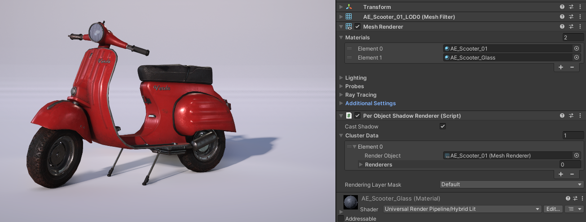
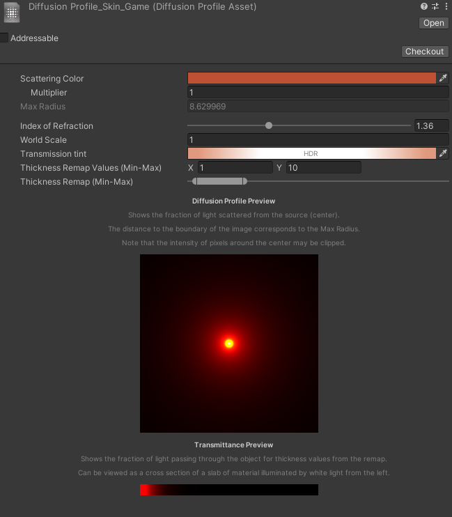
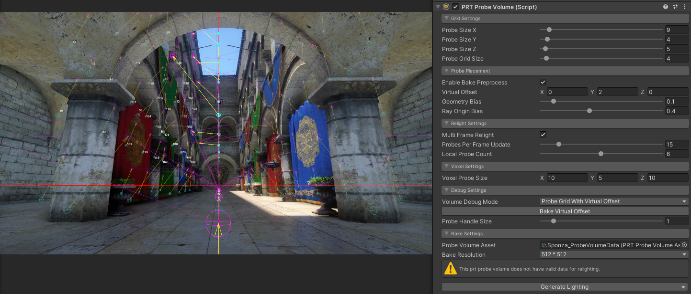
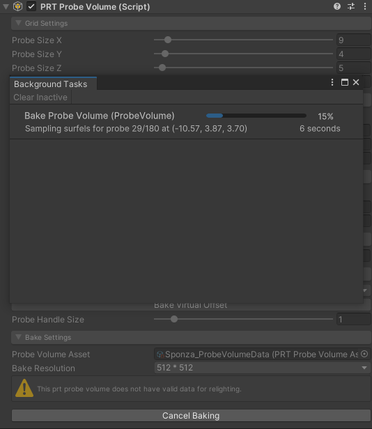
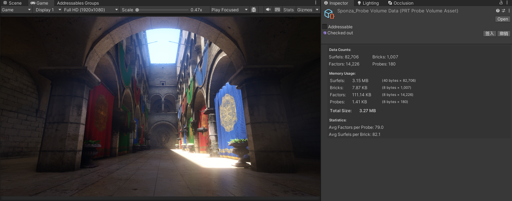

# Per Object Shadow

Per Object Shadow provides high-quality shadow casting for individual objects, particularly useful for characters and important scene elements. Each object with a `PerObjectShadowRenderer` component receives its own shadow map tile in a shared atlas, enabling better shadow quality and filtering compared to standard shadow maps.



## Setting Up Per Object Shadows

To use Per Object Shadows, you need to add the `PerObjectShadowRenderer` component to your GameObject:

1. Select the GameObject that should cast per-object shadows (typically a character or important object).
2. Add the **Per Object Shadow Renderer** component.
3. Configure the **Cluster Data** array:
   - **Render Object**: The main renderer used for shadow bounds calculation.
   - **Renderers**: Additional renderers that should be included in the shadow casting cluster.
4. Set the **Rendering Layer Mask** to control which rendering layers the shadow casters belong to.
5. Enable **Cast Shadow** to activate shadow casting for this renderer.

The component automatically registers itself with the shadow system when enabled and unregisters when disabled.

## Properties

### PerObjectShadowRenderer Component

| Property | Description |
|----------|-------------|
| **Cast Shadow** | Enable/disable shadow casting for this renderer. |
| **Cluster Data** | Array of shadow caster clusters. Each cluster contains a render object and additional renderers that cast shadows together. |
| **Rendering Layer Mask** | Sets the rendering layers for all renderers in the cluster. Used to filter which objects receive shadows. |

### Cluster Data

| Property | Description |
|----------|-------------|
| **Render Object** | The primary renderer used for calculating shadow bounds. This renderer is always included in the cluster. |
| **Renderers** | Additional renderers to include in the shadow casting cluster. All renderers in a cluster cast shadows together. |

### Per Object Shadows Volume Component

You can add the **Illusion/Per Object Shadows** Volume component to configure global per-object shadow settings:

| Property | Description |
|----------|-------------|
| **Depth Bits** | Sets the depth buffer precision for the per-object shadow map. Options: **Depth16** or **Depth24**. Higher precision improves shadow quality but uses more memory. |
| **Tile Resolution** | Sets the resolution for each tile in the per-object shadow atlas. Options range from **256** to **2048**. Higher resolutions provide sharper shadows but increase memory usage. |
| **Shadow Length Offset** | Controls the offset distance for shadow length calculation (0-1000). Used for culling shadows that are too far from the camera. |

## Integration with Screen Space Shadows

Per Object Shadows are automatically combined with the main directional light shadow map in the Screen Space Shadows pass. This enables advanced shadow filtering techniques like PCSS to work with per-object shadows.

> [!TIP]
> Per Object Shadows work seamlessly with PCSS. When PCSS is enabled, per-object shadows receive the same soft penumbra filtering as the main light shadows.

## Transparent Object Support

By default, transparent objects cannot receive per-object shadows (similar to Screen Space Shadows). However, you can enable support for transparent objects:

1. In your URP Renderer asset, select the **Illusion Graphics** renderer feature.
2. Enable **Transparent Receive Per Object Shadows**.

> [!Warning]
> Enabling transparent object support for per-object shadows will decrease performance, as transparent objects require additional shadow sampling passes.

## Limitations

> [!Warning]
> Per Object Shadows are limited by the shadow atlas size. If too many objects with `PerObjectShadowRenderer` components are active simultaneously, some shadows may not be rendered. The system prioritizes shadows based on distance and priority.

> [!TIP]
> Use Rendering Layer Masks to control which objects receive per-object shadows. This helps manage performance by removing duplicated main light shadow sampling to specific layers.

## Customization

If your scene has dynamic renderers that change at runtime (for example, character equipment swapping systems), you can implement a custom shadow caster by directly inheriting from the `IShadowCaster` interface and registering it with `ShadowCasterManager`. 

Here's an example of how to create a custom shadow caster for dynamic renderers:

```csharp
using UnityEngine;
using Illusion.Rendering.Shadows;

public class DynamicShadowCaster : MonoBehaviour, IShadowCaster
{
    private int _shadowCasterId = -1;

    private float _priority;

    private readonly ShadowRendererList _shadowRendererList = new();
    
    // IShadowCaster implementation
    public int Id { get => _shadowCasterId; set => _shadowCasterId = value; }

    public float Priority { get => _priority; set => _priority = value; }
    
    public ShadowRendererList.ReadOnly RendererList => _shadowRendererList.AsReadOnly();

    public Transform Transform => transform;
    
    // Main renderer used for bounds calculation
    public Renderer mainRenderer;
    
    // Dynamic list of renderers that can change at runtime
    private List<Renderer> _dynamicRenderers = new();
    
    private void Awake()
    {
        // Initialize the shadow renderer list
        _shadowRendererList.RenderObject = mainRenderer;
        // Set the bound type to be calculated by render list
        _shadowRendererList.BoundType = ShadowBoundType.Calculated;
    }
    
    private void OnEnable()
    {
        // Register this caster with the shadow system
        ShadowCasterManager.Register(this);
        UpdateRendererList();
    }
    
    private void OnDisable()
    {
        // Unregister when disabled
        ShadowCasterManager.Unregister(this);
    }
    
    public bool CanCastShadow()
    {
        return isActiveAndEnabled && mainRenderer;
    }
    
    // Call this method whenever renderers change (e.g., when equipment is swapped)
    public void UpdateRendererList()
    {
        _shadowRendererList.Clear();
        
        // Add main renderer
        if (mainRenderer != null)
        {
            _shadowRendererList.Add(mainRenderer);
        }
        
        // Add all dynamic renderers
        foreach (var renderer in _dynamicRenderers)
        {
            if (renderer != null && renderer.enabled)
            {
                _shadowRendererList.Add(renderer);
            }
        }
    }
    
    // Example method for adding renderers dynamically (e.g., when equipping items)
    public void AddRenderer(Renderer renderer)
    {
        if (renderer != null && !_dynamicRenderers.Contains(renderer))
        {
            _dynamicRenderers.Add(renderer);
            UpdateRendererList();
        }
    }
    
    // Example method for removing renderers dynamically (e.g., when unequipping items)
    public void RemoveRenderer(Renderer renderer)
    {
        if (_dynamicRenderers.Remove(renderer))
        {
            UpdateRendererList();
        }
    }
    
    // Clear all dynamic renderers
    public void ClearDynamicRenderers()
    {
        _dynamicRenderers.Clear();
        UpdateRendererList();
    }
}
```


# Screen Space Subsurface Scattering

Screen Space Subsurface Scattering (SSSS) simulates the translucency and soft light diffusion characteristic of skin, wax, jade, and other subsurface-scattering materials. When light enters these materials, it scatters beneath the surface before exiting, creating a soft, organic appearance. IllusionRP's SSSS implementation is based on HDRP's approach, using diffusion profiles to define how light scatters through different materials.

## Diffusion Profile

The Diffusion Profile in IllusionRP is basically the same as HDRP. For documentation, please refer to [HDRP - Diffusion Profile](https://docs.unity.cn/Packages/com.unity.render-pipelines.high-definition@16.0//manual/Diffusion-Profile.html).



> [!TIP]
> It should be noted that IllusionRP has removed the default profile originally designed by HDRP. Now the first one in the profile list is the actual default profile.

# Screen Space Ambient Occlusion (GTAO)

Ground Truth Ambient Occlusion (GTAO) provides high-quality screen space ambient occlusion based on horizon search in a depth-normal buffer. IllusionRP integrates a GTAO implementation similar to HDRP, with additional controls exposed through the Volume system.

## Enabling GTAO

GTAO is controlled by both the renderer feature and a Volume component:

1. In your URP Renderer asset, select the **Illusion Graphics** renderer feature.
2. In the **Illusion Graphics** inspector, enable **Ground Truth AO**.
3. In your Volume profile, add the **Illusion/Ground Truth Ambient Occlusion** component.
4. In the component, set **Enable** to **On** to activate the effect for that Volume.

The renderer only runs GTAO when both the renderer feature toggle and the Volume `enable` flag are true for the active camera.

## Properties

| Property | Description |
|----------|-------------|
| **Enable** | Turns GTAO on or off for this Volume. |
| **Down Sample** | Computes GTAO at half resolution for better performance at the cost of some fine details. |
| **Intensity** | Global strength of the AO darkening (0-4). Higher values produce darker occluded regions. |
| **Direct Lighting Strength** | Controls how much AO affects direct lighting versus indirect lighting only (0-1). |
| **Radius** | Sampling radius in world units (0.25-5). Larger values capture wider occlusion but blur details and increase cost. |
| **Thickness** | Heuristic to bias occlusion for thin vs. thick geometry (0.001-1). |
| **Blur Quality** | Chooses the blur algorithm: **Spatial** (compute shader, high quality), **Bilateral** (pixel shader), or **Gaussian** (pixel shader). |
| **Blur Sharpness** | Controls edge preservation for non-temporal blur (0-1). Lower values are softer; higher values keep sharper edges. |
| **Step Count** | Number of steps per direction during horizon search (2-32). Higher values improve quality but increase cost. |
| **Maximum Radius In Pixels** | Caps the effective radius in screen space (16-256) to keep performance predictable. This value is scaled for resolutions other than 1080p. |
| **Direction Count** | Number of ray directions used when temporal accumulation is disabled (1-6). |

## Limitations

> [!Warning]
> GTAO is a screen space effect. It only occludes what is visible in the depth buffer and cannot see off-screen or hidden geometry.

> [!TIP]
> GTAO replaces URP's built-in SSAO when enabled. Avoid enabling both at the same time to prevent double-darkening your scene.

## Performance Considerations

GTAO performance is primarily affected by the following parameters:

- **Down Sample**: Enabling half-resolution processing significantly reduces cost with minimal quality loss for most scenes.
- **Step Count**: Reducing step count is the most effective way to improve performance while maintaining reasonable quality.
- **Maximum Radius In Pixels**: Large radii at high resolutions (4K) can be very expensive due to cache misses.
- **Direction Count**: Lower direction counts reduce cost but may introduce visible banding in some cases.

For mobile platforms, prefer half resolution with a smaller radius and reduced step count.

# Screen Space Reflection (SSR)

Screen Space Reflection adds real-time reflections based on the camera's depth and color buffers. IllusionRP's SSR implementation supports multiple tracing modes and two reflection algorithms.

## Enabling SSR

SSR requires both the renderer feature and a Volume component, along with shader support:

1. In the **Illusion Graphics** renderer feature, enable **Screen Space Reflection**.
2. In your Volume profile, add **Illusion/Screen Space Reflection** and set **Enable** to **On**.
3. Use shaders that support **Forward GBuffer** (for example `Hybrid Lit` or IllusionRP templates with a `ForwardGBuffer` pass).

IllusionRP automatically schedules a Forward GBuffer prepass when SSR is active in forward rendering mode. Objects using shaders without a `ForwardGBuffer` pass will not receive screen space reflections.

> [!TIP]
> For more technical details about SSR implementation in forward rendering, please refer to [URP Screen Space Reflection Practice](https://zhuanlan.zhihu.com/p/1912828657585590857).

## Properties

| Property | Description |
|----------|-------------|
| **Enable** | Turns SSR on or off for this Volume. |
| **Mode** | Chooses the ray marching method: **LinearVS** (view space linear), **LinearSS** (screen space linear), or **HizSS** (hierarchical Z-buffer). Hi-Z mode is recommended for most cases. |
| **Algorithm** | Selects between **Approximation** (cheaper legacy mode) and **PBR Accumulation** (temporally accumulated physically-based reflections). |
| **Intensity** | Overall contribution of SSR to the final reflection (0.01-2). |
| **Thickness** | Approximate thickness of reflected geometry (0-1). Larger values help avoid leaks but can miss thin objects. |
| **Min Smoothness** | Minimum material smoothness required to receive SSR (0.01-1). |
| **Smoothness Fade Start** | Smoothness value at which SSR starts to fade out (0-1). |
| **Screen Fade Distance** | Fades reflections near the edge of the screen (0-1) to reduce popping when rays leave the viewport. |
| **Accumulation Factor** | Controls temporal accumulation strength (0-1). Higher values reduce noise but increase ghosting. |
| **Bias Factor** | Bias for PBR accumulation (0-1); controls how much history influences the reflection. |
| **Speed Rejection Param** | Controls history rejection based on motion (0-1). Higher values reject history more aggressively when objects move. |
| **Speed Rejection Scaler Factor** | Upper range of speed for rejection (0.001-1). Increase for fast-moving objects or cameras. |
| **Enable World Space Rejection** | When enabled, uses world space speed from motion vectors to reject samples. |
| **Steps** | Maximum number of steps per ray (60-500). Higher values improve hit rate at higher cost. |
| **Step Size** | Step length for linear modes (0.01-0.25). Smaller values increase precision and cost. Not used by Hi-Z mode. |

## Limitations

> [!Warning]
> SSR is screen-space only and cannot reflect objects that are off-screen or hidden behind other geometry, it will sample reflection probes as fallback.

> [!TIP]
> Shader need contribute to SSR should always have Forward GBuffer pass.
> 
> For shaders created by ASE, you need set stencil mask to 4(0100) manually.


## Performance Considerations

- **Hi-Z mode** usually provides the best balance of quality and performance.
- **Steps** is the primary quality/performance tradeoff for ray marching.
- **PBR Accumulation** trades noise for ghosting; adjust `Accumulation Factor` and speed rejection parameters based on your scene's motion characteristics.
- For static scenes, higher accumulation factors produce cleaner results; for dynamic scenes, lower values reduce ghosting.

# Screen Space Shadows

IllusionRP provides a Screen Space Shadows pass that re-projects the main directional light shadow map into screen space and optionally combines it with contact shadows and per-object shadows.

## How Screen Space Shadows Work

The Screen Space Shadows pass is scheduled in the Shadows prepass and writes a screen-space shadow mask texture. This texture combines:

- The main light shadow map (including cascades)
- Per-object shadow maps for characters (if enabled)
- Contact Shadows (if enabled)

Receivers sample this screen-space shadow mask instead of the standard shadow map, which enables advanced shadow filtering techniques like PCSS.

## Limitations

> [!Warning]
> **Transparent objects cannot use Screen Space Shadows.** Transparent passes render after the Screen Space Shadows pass and therefore only see pre-depth. Their lighting falls back to regular shadow maps. This is a fundamental limitation of screen-space shadow techniques.

> [!TIP]
> For transparent objects that need high-quality shadows, consider using Per-Object Shadows with the `transparentReceivePerObjectShadows` option enabled in the renderer feature.

# Percentage Closer Soft Shadows (PCSS)

Percentage Closer Soft Shadows (PCSS) adds physically-motivated soft penumbrae to shadows. The penumbra size varies based on the distance between the occluder and receiver, producing more realistic shadow edges.

## Enabling PCSS

1. In the **Illusion Graphics** renderer feature, enable **PCSS Shadows**.
2. In your Volume profile, add **Illusion/Percentage Closer Soft Shadows**.
3. Adjust the penumbra and quality settings as needed.

> [!Warning]
> **PCSS only works with Screen Space Shadows.** This means PCSS only affects:
> - Main directional light cascades rendered into the screen space shadow map
> - Per-object shadows that are combined into the same screen space mask
>
> Other shadow types (additional lights, shadows not going through the screen space path) are not affected by PCSS.

## Properties

| Property | Description |
|----------|-------------|
| **Angular Diameter** | Apparent angular size of the light source in degrees. Larger values produce softer, wider penumbrae. |
| **Blocker Search Angular Diameter** | Angular size used when searching for occluders in degrees. Higher values consider more of the shadow map. |
| **Min Filter Max Angular Diameter** | Minimum angular diameter used for filtering in degrees, preventing overly small penumbrae. |
| **Max Penumbra Size** | Maximum penumbra size in world units (0-10). |
| **Max Sampling Distance** | Maximum distance over which PCSS samples blockers in the shadow map (0-2). |
| **Min Filter Size Texels** | Minimum blur radius in texels (0.1-10). |
| **Find Blocker Sample Count** | Number of samples used in the blocker search step (4-64). Higher values improve quality but cost more. |
| **PCF Sample Count** | Number of samples used in the PCF filtering step (4-64). |
| **Penumbra Mask Scale** | Downscale factor for the penumbra mask texture (1-32). Higher values use smaller textures (faster, lower quality). |

## Performance Considerations

- **Penumbra Mask Scale** is the primary performance lever. A value of 4 provides a good balance for most scenes.
- **Find Blocker Sample Count** and **PCF Sample Count** directly affect quality and cost. Start with lower values (16-24) and increase if needed.
- For large outdoor scenes, start with a modest **Angular Diameter** to avoid overly soft shadows that lose definition.

# Precomputed Radiance Transfer Global Illumination

Precomputed Radiance Transfer Global Illumination (PRTGI) provides stable, low-quality but dynamic indirect lighting by baking precomputed radiance into probe volumes. It is particularly well-suited for large outdoor environments and can be combined with SSGI for enhanced local bounce lighting.

## Setting Up a PRT Probe Volume

To use PRTGI, you need to create a PRT Probe Volume component in your scene:

1. Create an empty GameObject in your scene and add the **PRT Probe Volume** component.
2. Position and scale the volume to cover the area where you want indirect lighting.
3. Configure the probe grid settings based on your scene's scale and detail requirements.



## Properties

### Grid Settings

| Property | Description |
|----------|-------------|
| **Probe Size X/Y/Z** | Number of probes along each axis. More probes provide finer detail but increase bake time and memory usage. |
| **Probe Grid Size** | Spacing between probes in world units. Smaller values capture more detail but require more probes. |

### Probe Placement

| Property | Description |
|----------|-------------|
| **Enable Bake Preprocess** | When enabled, performs preprocessing to optimize probe placement before baking. |
| **Virtual Offset** | Offset applied to probe positions to avoid placing probes inside geometry (X, Y, Z). |
| **Geometry Bias** | Bias value to prevent probes from being placed too close to surfaces (0-1). |
| **Ray Origin Bias** | Offset applied to ray origins during baking to avoid self-intersection artifacts (0-1). |

### Relight Settings

| Property | Description |
|----------|-------------|
| **Multi Frame Relight** | Distributes relighting computation across multiple frames for smoother performance. |
| **Probes Per Frame Update** | Number of probes updated per frame when Multi Frame Relight is enabled. |
| **Local Probe Count** | Number of nearby probes sampled for each pixel during rendering. |

### Voxel Settings

| Property | Description |
|----------|-------------|
| **Voxel Probe Size** | Size of voxels used for probe interpolation (X, Y, Z). Affects the smoothness of GI transitions. |

### Debug Settings

| Property | Description |
|----------|-------------|
| **Volume Debug Mode** | Visualization mode for debugging probe placement and data. Options include **Probe Grid With Virtual Offset**. |
| **Bake Virtual Offset** | Button to bake virtual offset data for probe placement optimization. |
| **Probe Handle Size** | Size of probe gizmos displayed in the Scene view. |

### Bake Settings

| Property | Description |
|----------|-------------|
| **Probe Volume Asset** | Reference to the PRT Probe Volume Asset that stores baked data. |
| **Bake Resolution** | Resolution of the baking process. Higher values produce more accurate results but take longer to bake. |

## Baking Workflow

Follow these steps to bake PRTGI data for your scene:

1. Select the GameObject with the **PRT Probe Volume** component.
2. Make scene objects tag with **Static**.
3. In the Inspector, configure the Grid Settings and Probe Placement parameters according to your scene requirements.
4. Assign or create a **Probe Volume Asset** in the Bake Settings section to store the baked data.
5. Click the **Generate Lighting** button at the bottom of the Inspector to start the baking process.



During baking, a **Background Tasks** window will appear showing the progress. The window displays the current probe being processed (e.g., "Sampling surfels for probe 29/180") along with a progress percentage and estimated time. You can click **Cancel Baking** to abort the process if needed.

> [!Warning]
> **Do not modify the scene or edit code while baking is in progress.** Changing scene geometry, lighting, or scripts during the bake process may cause incorrect results or baking failures. Wait for the baking to complete before making any changes.

## Baked Data

After baking completes, the **PRT Probe Volume Asset** stores all the computed data. You can inspect the asset to view statistics about the baked data:



The asset inspector displays:

- **Data Counts**: Number of Surfels, Bricks, Factors, and Probes in the baked data.
- **Memory Usage**: Memory consumption breakdown for each data type (Surfels, Bricks, Factors, Probes) and the total size.
- **Statistics**: Average Factors per Probe and Average Surfels per Brick, which indicate the complexity of your scene's lighting.

## Enabling PRTGI in the Renderer

To use the baked PRTGI data at runtime:

1. In your URP Renderer asset, select the **Illusion Graphics** renderer feature.
2. Enable **Precomputed Radiance Transfer GI** in the feature settings.
3. Ensure your PRT Probe Volume is active in the scene with valid baked data.

## Performance Considerations

PRTGI runtime performance is primarily affected by the following factors:

- **Probe Count**: More probes increase memory usage and sampling cost. Balance detail requirements with performance.
- **Local Probe Count**: Higher values produce smoother interpolation but cost more per pixel.
- **Probes Per Frame Update**: When using Multi Frame Relight, higher values update lighting faster but may cause frame rate hitches.

For mobile platforms, use fewer probes with larger grid spacing and enable Multi Frame Relight to distribute the update cost.

# Screen Space Global Illumination (SSGI)

Screen Space Global Illumination computes diffuse indirect lighting in screen space using ray marching and temporal-spatial denoising. It can be combined with Precomputed Radiance Transfer (PRTGI) for stable low-frequency GI, or used alone for fully dynamic scenes.

## Enabling SSGI

1. In the **Illusion Graphics** renderer feature, enable **Screen Space Global Illumination**.
2. In your Volume profile, add **Illusion/Screen Space Global Illumination** and set **Enable** to **On**.
3. Optionally enable **Precomputed Radiance Transfer GI** in the renderer feature if you want SSGI to fall back to PRT probes when rays miss.

The renderer only runs SSGI when the renderer feature toggle, runtime config, and Volume component are all enabled.

> [!TIP]
> A recommended workflow is to use PRTGI for large-scale outdoor lighting and add SSGI in interiors to capture local bounce from dynamic lights and emissive surfaces.


## Properties

| Property | Description |
|----------|-------------|
| **Enable** | Turns SSGI on or off for this Volume. |
| **Half Resolution** | Computes and reprojects at half resolution. Improves performance but reduces detail. |
| **Depth Buffer Thickness** | Thickness tolerance in depth when ray marching (0-0.5). Higher values are more forgiving but can cause light leaks. |
| **Max Ray Steps** | Maximum number of steps per SSGI ray (1-256). More steps improve quality but cost more. |
| **Ray Miss** | Fallback hierarchy when rays miss geometry: **Reflection Probes and Sky**, **Reflection Probes**, **Sky**, or **None**. |
| **Enable Probe Volumes** | Allows SSGI to sample PRT probe volumes as part of the fallback when rays miss. |
| **Denoise** | Enables temporal and spatial denoising for smoother GI. |
| **Denoiser Radius** | Radius of the bilateral spatial filter (0.001-10). Larger radius smooths more but can smear details. |
| **Second Denoiser Pass** | Enables a second denoising pass for higher quality at extra cost. |
| **Half Resolution Denoiser** | Applies the denoiser at half resolution and upsamples, improving performance. |

## Limitations

> [!Warning]
> Like SSR and GTAO, SSGI is a screen space effect. It cannot see behind the camera or through occluders, so you should always combine it with PRTGI, or ambient probes as fallback.

## Performance Considerations

- **Half Resolution** and **Half Resolution Denoiser** are the key performance switches.
- **Max Ray Steps** and **Denoiser Radius** directly affect cost.
- On PC/consoles, you can afford full-resolution SSGI with higher ray steps; on mobile, prefer half resolution with a smaller denoiser radius.
- Disabling the second denoiser pass can save significant performance with acceptable quality loss in many scenes.

# Global Illumination Control

IllusionRP uses the Main Light's `Indirect Multiplier` to control the intensity of global illumination. This affects both PRTGI and SSGI.