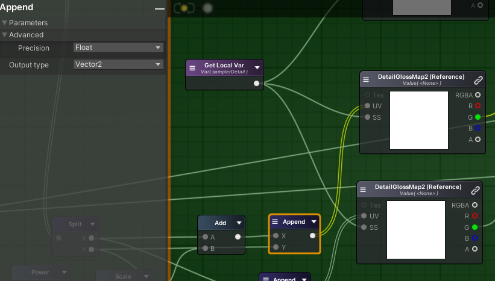

# Optimization

Some optimization tips.

## Mobile Precision

To optimize ALU in mobile platform, shader should use <b>Half Precision</b> (FP16).

However, you may meet bug without strict precision conversion.

IllusionRP modify ASE's source code in order to ensure each node's precision is correct, always setting the precision of variables passed to the UV port to <b>Float</b>.

