# Render Pipeline

IllusionRP is completely based on Scriptable Render Pipelines (SRP) architecture.

All passes are inserted into the rendering process according to certain order. See `IllusionRenderPassEvent` for more details.

Following is the pipeline graph:

```mermaid 
graph TD

subgraph Prepass Depth
  DepthNormalPostPass[Transparent Post Depth Normal]
  CopyPreDepth[Transparent Copy Pre Depth]
  DepthPyramid[Depth Pyramid]
  DepthPostPass[Transparent Post Depth]
end

subgraph Prepass GBuffer
  ForwardGBuffer[Forward GBuffer]
  MotionVectorsPrepass[Early Motion Vectors]
end

subgraph Prepass Screen Space Lighting
  GTAO[Ground Truth Ambient Occlusion]
  SSR[Screen Space Reflection]
end

subgraph Prepass Shadows Part
  MainLightShadow[Main Light Shadow]
  AdditionalLightShadows[Additional Light Shadows]
  PerObjectShadows[Per Object Shadows]
  ContactShadows[Contact Shadows]
  PCSS[PCSS Filtering]
  ScreenSpaceShadows[Screen Space Shadows]
end

subgraph Prepass Global Illumination
  PRTRelight[Precompute Radiance Transfer Relight]
  SSGI[Screen Space Global Illumination]
end

subgraph After Rendering Gbuffer
  Subsurface[Subsurface Scattering]
end

subgraph After Transparent
  OIT[OIT]
  CopyPostDepth[Transparent Copy Post Depth]
  TransparentOverdraw[Transparent Overdraw]
  ColorPyramid[Color Pyramid]
end

subgraph Before Post Processing
  DownsampleDepth[Downsample Depth]
  VolumetricLight[Volumetric Light]
  Exposure[Atomatic Exposure]
  Bloom[Convolution Bloom]
end

subgraph After Rendering
  Debug[Full Screen Debug]
end

%% Flow Arrows
DepthNormalPostPass --> CopyPreDepth
CopyPreDepth --> DepthPyramid
DepthPyramid --> DepthPostPass
DepthPostPass --> ForwardGBuffer
ForwardGBuffer --> MotionVectorsPrepass
MotionVectorsPrepass --> GTAO
GTAO --> SSR
SSR --> MainLightShadow
MainLightShadow --> AdditionalLightShadows
AdditionalLightShadows --> PerObjectShadows
PerObjectShadows --> ContactShadows
ContactShadows --> PCSS
PCSS --> ScreenSpaceShadows
ScreenSpaceShadows --> PRTRelight
PRTRelight --> SSGI
SSGI --> Subsurface
Subsurface --> OIT
OIT --> CopyPostDepth
CopyPostDepth --> TransparentOverdraw
TransparentOverdraw --> ColorPyramid
ColorPyramid --> DownsampleDepth
DownsampleDepth --> VolumetricLight
VolumetricLight --> Exposure
Exposure --> Bloom
Bloom --> Debug
```

## Limitations

Due to the limitations of URP design, `Native Render Pass` requires the number of custom passes to be less than 20 (see `ScriptableRenderer.kRenderPassMaxCount`), and the number used by IllusionRP far exceeds this threshold. Therefore, you cannot check `Native Render Pass` in RendererAsset after turning on IllusionRP.