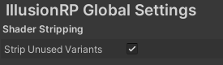

# Shader Workflow

IllusionRP combines handwritten HLSL lighting models with the **Amplify Shader Editor (ASE)** node-based workflow. Custom lighting calculations are implemented in HLSL include files, while material-level functionality (textures, parameters, vertex modifications) is built using ASE's visual graph on top of IllusionRP's template shaders.

For post-processing and screen-space effects, IllusionRP uses the **Volume System** for per-camera configuration and **RendererFeatures** for global enable/disable switches.

## Getting Started

To create a new character shader in IllusionRP:

1. Open one of the template shaders in ASE (e.g., `Skin Template.shader`, `Hair Template.shader`).
2. In the ASE graph, configure the **Additional Options** panel to select lighting models and features.
3. Build your material graph by connecting texture samples and parameters to the template's input ports.
4. Save the shader and assign it to your materials.

If you just need a working shader without customization, use the pre-built **HD Shaders** (`HD Skin`, `HD Hair`, `HD Fabric`, `HD Lit`) directly.

# Shader Details

## HD Shaders vs Templates

IllusionRP provides two ways to use its shaders:

| Type | When to Use | Examples |
|------|-------------|----------|
| **HD Shaders** | Ready-to-use shaders for production. Use these when you don't need custom material graphs. | `HD Skin`, `HD Hair`, `HD Fabric`, `HD Lit` |
| **Templates** | Starting points for custom ASE graphs. Use these when you need to add custom logic, blend multiple effects, or create unique materials. | `Skin Template`, `Hair Template`, `Fabric Template`, `Hybrid Lit Template` |

HD Shaders use HDRP-compatible surface properties, which means you can convert HDRP materials to IllusionRP shaders directly by matching property names.

## Stencil Mask

IllusionRP uses stencil masks to identify material types for screen-space effects. The templates configure these automatically; you should not modify them unless you understand the implications.

### Forward / ForwardGBuffer Passes

| Ref (Binary) | Ref (Decimal) | Usage |
|--------------|---------------|-------|
| 0001 | 1 | Skin (enables Screen Space SSS) |
| 0010 | 2 | Hair (used for OIT overdraw) |
| 0100 | 4 | Receive Screen Space Reflection |

### DepthOnly / DepthNormals Passes

| Ref (Binary) | Ref (Decimal) | Usage |
|--------------|---------------|-------|
| 0001 | 1 | Not Receive Ambient Occlusion |

> [!Warning]
> Changing stencil values can break screen-space effects. For example, removing the Skin stencil (1) will disable Screen Space SSS for that material; removing the SSR stencil (4) will prevent the material from receiving screen-space reflections.

## Hair Rendering Modes

IllusionRP supports two approaches for rendering semi-transparent hair:

### OIT Hair (Order Independent Transparency)

OIT allows transparent hair strands to be drawn in any order without sorting artifacts. This produces the highest quality results for multi-layer hair but has higher performance cost.

To enable OIT hair:
1. In the Hair Template, enable **Multi Pass** in Additional Options. This adds the `OITTransparent` and `PostDepthOnly` passes.
2. In the Illusion Graphics renderer feature, enable **Order Independent Transparency**.

IllusionRP draws OIT objects after standard transparent objects to maintain compatibility:

1. Draw opaque part of hair (alpha cutoff).
2. Draw standard transparent objects.
3. Draw OIT transparent part of hair.

> [!TIP]
> To allow standard transparent objects to appear in front of OIT hair, enable `Transparent Depth Post Pass` and `OIT Transparent Overdraw Pass` in the renderer feature. Set `OIT Stencil` to `2` (binary 0010) to overdraw only the hair area.

For more techniques, please refer to [How to Render Hair More Smoothly in Unity URP](https://zhuanlan.zhihu.com/p/1907549925065070387).

### Dithering Hair

Dithering is a more common approach in modern games. It uses alpha testing with a dithered threshold pattern, which produces noise that is resolved by Temporal Anti-Aliasing (TAA).

To use dithering hair:
1. In the Hair Template, disable **Multi Pass** in Additional Options. This removes the OIT passes and uses single-pass rendering.
2. The shader will automatically use Bayer dithering for alpha testing.

If you don't need OIT at all, you can disable it globally by turning off `Order Independent Transparency` in the Illusion Graphics renderer feature.

> [!Warning]
> Dithering hair requires **Temporal Anti-Aliasing (TAA)** to resolve the dither pattern. Without TAA, you will see visible stippling noise on hair edges.

## Forward GBuffer

IllusionRP uses a Forward GBuffer pass to enable screen-space effects (SSR, SSGI) in forward rendering. Shaders must include a `ForwardGBuffer` pass to receive these effects.

> [!Warning]
> Several template options will remove the ForwardGBuffer pass, causing materials to lose SSR and SSGI support:
> - **Forward Only**: Explicitly removes the GBuffer pass.
> - **Transmission** / **Translucency** (in Fabric and Hybrid Lit templates): These options automatically set Forward Only and exclude the GBuffer pass.
>
> If you need SSR/SSGI on a material, do not enable these options.

For more technical details, please refer to [URP Forward Rendering Path Screen Space Reflection Practice](https://zhuanlan.zhihu.com/p/1912828657585590857).

# Shader Template Details

This section documents all customizable options for ASE template files in IllusionRP.

## Available Templates

| Template | IllusionRP-Specific Options | Lighting Features |
|----------|----------------------------|-------------------|
| **Hair Template** | **Diffuse Attenuation**: Kajiya / Uncharted **Shading Model**: Kajiya / Marschner **Multi Pass**: Enables OIT rendering | Kajiya-Kay or Marschner hair shading Backlight scattering Order Independent Transparency |
| **Skin Template** | **Custom Subsurface Albedo**: Use separate albedo for SSS **Workflow**: Specular / Metallic Material properties: `_Smoothness1`, `_Smoothness2`, `_LobeWeight`, `_DiffusionProfile` | Screen Space Subsurface Scattering Spherical Gaussian SSS (mobile) Dual Lobe Specular |
| **Fabric Template** | **Transmission**: Enables light transmission **Translucency**: Enables translucency effect **Receive Occlusion**: Write depth for AO Material properties: `_Sheen_Color`, `_Sheen_Intensity`, `_Velvet`, `_Anisotropy_Intensity` | Anisotropy Specular Sheen Scattering (Ashikhmin/Charlie) Oren-Nayar Diffuse |
| **Hybrid Lit Template** | **Transmission**: Enables light transmission **Translucency**: Enables translucency effect **Tessellation**: Enables mesh tessellation **Meta Pass**: Include lightmap meta pass | Screen Space Reflection PreIntegrated IBL Screen Space Ambient Occlusion |

## Feature Dependencies

Some lighting features require both shader support and pipeline configuration:

| Feature | Shader Requirement | Pipeline Requirement |
|---------|-------------------|---------------------|
| Screen Space SSS | Skin Template with `_DiffusionProfile` | Enable **Subsurface Scattering** in Illusion Graphics + add **Diffusion Profile** Volume component |
| Screen Space Reflection | ForwardGBuffer pass (avoid Forward Only) | Enable **Screen Space Reflection** in Illusion Graphics + add **SSR** Volume component |
| Screen Space GI | ForwardGBuffer pass (avoid Forward Only) | Enable **Screen Space Global Illumination** in Illusion Graphics + add **SSGI** Volume component |
| OIT Hair | Hair Template with Multi Pass enabled | Enable **Order Independent Transparency** in Illusion Graphics |
| Dual Lobe Specular | Skin Template | Configure `_Smoothness1`, `_Smoothness2`, `_LobeWeight` material properties |

## Shader Stripping

IllusionRP automatically strips unused shader variants to reduce compilation time and build size. For example, if Screen Space Subsurface Scattering is enabled in all renderer features, the disabled variant will be stripped.

To disable shader stripping:

1. Open **Project Settings > Graphics > IllusionRP Global Settings**.
2. Uncheck **Strip Unused Variants**.

